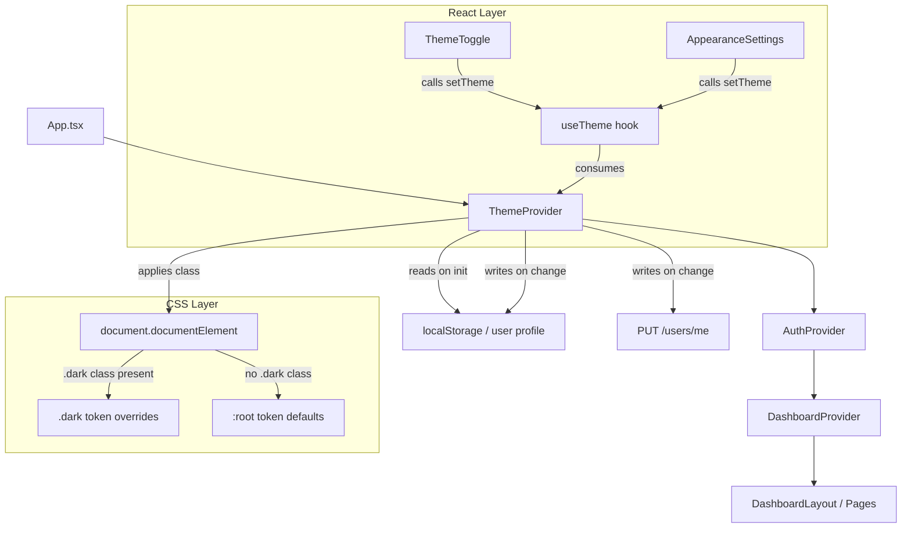

# Design Document: Dark Mode Theme Support

## Overview

This feature introduces a full theme token system and dark mode to the MentorsMind frontend. The approach centers on CSS custom properties as the single source of truth for all colors. A dedicated `ThemeContext` replaces the ad-hoc theme field in `DashboardContext`, manages OS preference detection, persists the user's choice to the backend (`PUT /users/me`), and falls back to `localStorage` for unauthenticated users. All components consume theme colors exclusively through Tailwind utility classes that resolve to the active token values — no hard-coded hex/rgb/hsl values are permitted outside the token definitions.

The existing `DashboardContext` already applies a `dark` class to `document.documentElement` and stores a `"light" | "dark"` theme value. This design extends that mechanism to support a third `"system"` option, moves theme ownership to a dedicated context, and wires up backend persistence.

---

## Architecture



**Key decisions:**

- `ThemeProvider` wraps `AuthProvider` so it can read the user profile's `theme_preference` field during auth initialization and apply the theme before the first render.
- The `DashboardContext` `theme` field and `toggleTheme` are deprecated in favor of `useTheme`. The existing `ThemeToggle` stub is updated to consume `useTheme`.
- Theme application (adding/removing the `dark` class) happens synchronously inside `ThemeProvider` to avoid a flash of the wrong theme.

---

## Components and Interfaces

### ThemeContext

```typescript
type ThemePreference = 'light' | 'dark' | 'system';
type ResolvedTheme = 'light' | 'dark';

interface ThemeContextType {
  /** The user's stored preference (light | dark | system) */
  preference: ThemePreference;
  /** The currently active resolved theme (light | dark) */
  resolved: ResolvedTheme;
  /** Change the preference; triggers persistence */
  setTheme: (preference: ThemePreference) => void;
}
```

**File:** `src/contexts/ThemeContext.tsx`

### ThemeProvider

Responsibilities:
1. On mount, resolve the initial theme from (in priority order): user profile `theme_preference` → `localStorage` → `prefers-color-scheme` media query → `'light'`
2. Apply the resolved theme to `document.documentElement` synchronously
3. Listen for `prefers-color-scheme` changes when preference is `'system'`
4. On `setTheme`, update state, apply the class, persist to `localStorage`, and (if authenticated) call `PUT /users/me`
5. On API failure, retain the applied theme and emit a toast error

### useTheme hook

```typescript
// src/hooks/useTheme.ts
export function useTheme(): ThemeContextType
```

Thin wrapper around `useContext(ThemeContext)` with a guard that throws if used outside `ThemeProvider`.

### ThemeToggle (updated)

The existing stub at `src/components/dashboard/ThemeToggle.tsx` is updated to:
- Consume `useTheme` instead of `useDashboard`
- Render a three-option segmented control (Sun / Moon / Monitor icons) matching the `AppearanceSettings` UI pattern
- Show the active option highlighted

### AppearanceSettings (updated)

The existing `src/components/settings/AppearanceSettings.tsx` already renders three theme buttons. It will be wired to call `useTheme().setTheme` instead of the settings hook's `updateSettings('appearance', ...)`.

### theme.service.ts

```typescript
// src/services/theme.service.ts
export async function persistThemePreference(preference: ThemePreference): Promise<void>
```

Calls `PUT /users/me` with `{ theme_preference: preference }`. Throws on non-2xx so the caller can handle the error.

---

## Data Models

### CSS Token Definitions

All tokens are defined in `src/index.css`:

```css
:root {
  --color-background:           #ffffff;
  --color-surface:              #f9fafb;
  --color-border:               #e5e7eb;
  --color-primary:              #5B3FFF;
  --color-primary-foreground:   #ffffff;
  --color-secondary:            #f3f4f6;
  --color-secondary-foreground: #111827;
  --color-muted:                #f3f4f6;
  --color-muted-foreground:     #6b7280;
  --color-accent:               #ede9fe;
  --color-accent-foreground:    #4c1d95;
  --color-destructive:          #ef4444;
  --color-destructive-foreground: #ffffff;
  --color-text:                 #111827;
}

.dark {
  --color-background:           #0f172a;
  --color-surface:              #1e293b;
  --color-border:               #334155;
  --color-primary:              #7B61FF;
  --color-primary-foreground:   #ffffff;
  --color-secondary:            #1e293b;
  --color-secondary-foreground: #f1f5f9;
  --color-muted:                #1e293b;
  --color-muted-foreground:     #94a3b8;
  --color-accent:               #312e81;
  --color-accent-foreground:    #c7d2fe;
  --color-destructive:          #f87171;
  --color-destructive-foreground: #0f172a;
  --color-text:                 #f1f5f9;
}
```

### Tailwind Configuration

`tailwind.config.js` is extended to map utility classes to the CSS tokens:

```javascript
theme: {
  extend: {
    colors: {
      background:   'var(--color-background)',
      surface:      'var(--color-surface)',
      border:       'var(--color-border)',
      primary: {
        DEFAULT:    'var(--color-primary)',
        foreground: 'var(--color-primary-foreground)',
      },
      secondary: {
        DEFAULT:    'var(--color-secondary)',
        foreground: 'var(--color-secondary-foreground)',
      },
      muted: {
        DEFAULT:    'var(--color-muted)',
        foreground: 'var(--color-muted-foreground)',
      },
      accent: {
        DEFAULT:    'var(--color-accent)',
        foreground: 'var(--color-accent-foreground)',
      },
      destructive: {
        DEFAULT:    'var(--color-destructive)',
        foreground: 'var(--color-destructive-foreground)',
      },
      text:         'var(--color-text)',
    },
  },
}
```

### Theme Preference Storage

| Context | Storage | Key | Value |
|---|---|---|---|
| Unauthenticated | `localStorage` | `mm_theme_preference` | `"light"` \| `"dark"` \| `"system"` |
| Authenticated | Backend (`PUT /users/me`) + `localStorage` | `theme_preference` | same |

The `localStorage` copy is always written so the preference is available synchronously on the next page load before the auth check completes.

### CSS Transition

Applied globally in `src/index.css`:

```css
@layer base {
  *, *::before, *::after {
    transition-property: background-color, color, border-color, fill, stroke;
    transition-duration: 200ms;
    transition-timing-function: ease;
  }

  @media (prefers-reduced-motion: reduce) {
    *, *::before, *::after {
      transition-duration: 0ms;
    }
  }
}
```

---

## Correctness Properties

*A property is a characteristic or behavior that should hold true across all valid executions of a system — essentially, a formal statement about what the system should do. Properties serve as the bridge between human-readable specifications and machine-verifiable correctness guarantees.*

### Property 1: No hard-coded colors in component files

*For any* TypeScript/TSX file under `src/components/`, `src/pages/`, and `src/layouts/`, the file should not contain any hard-coded hex (`#rrggbb`), `rgb(...)`, or `hsl(...)` color values outside of `src/index.css` and `tailwind.config.js`.

**Validates: Requirements 1.4**

---

### Property 2: System preference is respected on first visit

*For any* value of `prefers-color-scheme` (`light` or `dark`) and given no stored `mm_theme_preference` in `localStorage`, the resolved theme returned by `ThemeProvider` initialization should equal the system preference value.

**Validates: Requirements 2.1, 2.2, 2.3**

---

### Property 3: Runtime system preference change is reflected

*For any* new value of `prefers-color-scheme` emitted at runtime, when the stored preference is `"system"`, the resolved theme should update to match the new system preference without a page reload.

**Validates: Requirements 2.4**

---

### Property 4: setTheme applies the .dark class correctly

*For any* call to `setTheme(preference)`, the `document.documentElement` should have the `dark` class if and only if the resolved theme is `'dark'`.

**Validates: Requirements 3.3, 5.1, 5.2, 5.3, 5.4, 5.5, 5.6, 5.7**

---

### Property 5: ThemeToggle reflects active preference

*For any* `ThemePreference` value (`light`, `dark`, `system`), when `ThemeContext` holds that preference, the `ThemeToggle` component should render the corresponding option as visually selected.

**Validates: Requirements 3.4**

---

### Property 6: Theme change triggers PUT /users/me within 500ms

*For any* `ThemePreference` value, when a logged-in user calls `setTheme`, the `theme.service.persistThemePreference` function should be called with that value within 500ms.

**Validates: Requirements 4.1**

---

### Property 7: Successful API response retains new preference

*For any* `ThemePreference` value, when `persistThemePreference` resolves successfully, the `ThemeContext` preference state should equal the new value.

**Validates: Requirements 4.2**

---

### Property 8: Failed API response retains applied theme and shows error

*For any* `ThemePreference` value, when `persistThemePreference` rejects, the resolved theme should remain the locally applied value and a non-blocking error toast should be displayed.

**Validates: Requirements 4.3**

---

### Property 9: Unauthenticated preference is persisted to localStorage

*For any* `ThemePreference` value, when an unauthenticated user calls `setTheme`, the value should be written to `localStorage` under the key `mm_theme_preference`.

**Validates: Requirements 4.5**

---

### Property 10: WCAG AA contrast ratios for all token pairs

*For any* (foreground-token, background-token) pairing used in the design (e.g. `--color-text` on `--color-background`, `--color-primary-foreground` on `--color-primary`), the computed contrast ratio should meet WCAG AA minimums: ≥ 4.5:1 for normal text pairings and ≥ 3:1 for large text and UI component pairings, in both the light and dark token sets.

**Validates: Requirements 7.1, 7.2, 7.3, 7.4**

---

## Error Handling

| Scenario | Behavior |
|---|---|
| `PUT /users/me` returns non-2xx | Theme remains applied locally; toast error shown: "Couldn't save theme preference." No retry. |
| `PUT /users/me` times out | Same as above. |
| `localStorage` unavailable (private browsing) | `setTheme` catches the `SecurityError` and continues without persistence; no error shown to user. |
| `matchMedia` not supported (old browser) | Falls back to `'light'` theme. |
| User profile `theme_preference` field missing | Falls back to `localStorage` → system preference → `'light'`. |

---

## Testing Strategy

### Unit Tests

Focus on specific examples, integration points, and error conditions:

- `ThemeProvider` initializes with the correct theme from user profile (example)
- `ThemeProvider` initializes with the correct theme from `localStorage` when no profile (example)
- `ThemeToggle` renders all three options (example)
- `ThemeToggle` shows the active option highlighted (example)
- `AppearanceSettings` Appearance section contains the theme control (example)
- `ThemeProvider` applies `.dark` class on `documentElement` when resolved theme is dark (example)
- `ThemeProvider` removes `.dark` class when resolved theme is light (example)
- `ThemeProvider` shows error toast when `PUT /users/me` fails (example)
- CSS transition is `200ms` by default and `0ms` under `prefers-reduced-motion` (example)

### Property-Based Tests

Use **fast-check** (already compatible with Vitest) for all property tests. Each test runs a minimum of **100 iterations**.

Tag format: `// Feature: dark-mode-theme-support, Property N: <property text>`

| Property | Test description | Generator |
|---|---|---|
| P1: No hard-coded colors | Scan all `.tsx`/`.ts` files under `src/` for color patterns | Static file scan (not randomized — run as a single assertion) |
| P2: System preference respected on first visit | Arbitrary `prefers-color-scheme` value with empty localStorage | `fc.constantFrom('light', 'dark')` |
| P3: Runtime system preference change | Arbitrary new system preference value when stored pref is `'system'` | `fc.constantFrom('light', 'dark')` |
| P4: `.dark` class correctness | Arbitrary `ThemePreference` → verify class presence matches resolved theme | `fc.constantFrom('light', 'dark', 'system')` × `fc.constantFrom('light', 'dark')` for system pref |
| P5: ThemeToggle reflects active preference | Arbitrary `ThemePreference` → verify selected option in rendered output | `fc.constantFrom('light', 'dark', 'system')` |
| P6: PUT /users/me called within 500ms | Arbitrary `ThemePreference` with fake timers | `fc.constantFrom('light', 'dark', 'system')` |
| P7: Successful API retains preference | Arbitrary `ThemePreference` with mocked success | `fc.constantFrom('light', 'dark', 'system')` |
| P8: Failed API retains theme + shows toast | Arbitrary `ThemePreference` with mocked failure | `fc.constantFrom('light', 'dark', 'system')` |
| P9: Unauthenticated localStorage persistence | Arbitrary `ThemePreference` with no auth | `fc.constantFrom('light', 'dark', 'system')` |
| P10: WCAG AA contrast | All token pairs in both themes | Static enumeration of token pairs |

### Test File Locations

```
src/__tests__/
  ThemeContext.test.tsx       — unit + property tests for ThemeProvider / useTheme
  ThemeToggle.test.tsx        — unit + property tests for ThemeToggle component
  theme.service.test.ts       — unit tests for persistThemePreference
  theme.tokens.test.ts        — P1 (no hard-coded colors) + P10 (contrast ratios)
```
